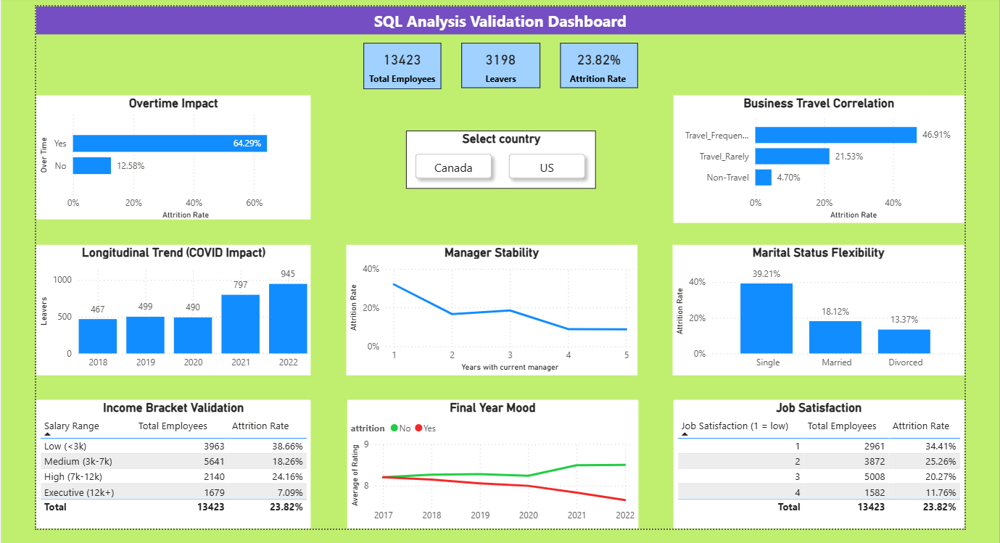

# HR Analytics: Employee Retention & Attrition Analysis

## 🎯 Project Overview
The primary goal of this project was to conduct a thorough analysis of employee turnover. I used **SQL (PostgreSQL) as the core analytical engine** to perform complex data exploration and identify key attrition drivers. Subsequently, I developed a **Power BI Dashboard to cross-validate these findings** and present them in an interactive, executive-ready format.

## 📊 Dashboard Preview

## 🛠️ Tech Stack
* **Database:** PostgreSQL (Core Analysis & ETL)
* **Tools:** pgAdmin 4, SQL
* **Visualization & Validation:** Power BI

## ⚙️ Workflow & Implementation
1. **SQL Deep-Dive Analysis:** Using CTEs, window functions, and complex joins, I analyzed 13k+ records to find correlations between overtime, income levels, and attrition.
2. **Business Logic Validation:** I used SQL to calculate specific metrics (attrition rates per segment) which were later mirrored and confirmed in Power BI.
3. **Data Visualization:** Built an interactive dashboard to make the SQL-discovered insights easily digestible for stakeholders.

## 💡 Key Business Insights (Verified by SQL & Power BI)
* **Overtime Impact:** SQL analysis revealed that employees working overtime show a **5x higher** attrition rate (64% vs 12%).
* **Income Risk:** Segmented data showed the "Low Income" bracket (<3k) as the highest risk group.
* **Manager Stability:** SQL queries identified a critical attrition spike during the first year under a new manager.

* **Data Source:** https://www.kaggle.com/datasets/jash312/hr-employee-attrition-datasets

